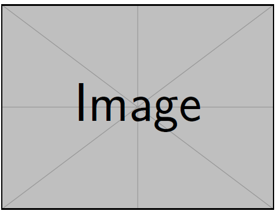

Tentang repositori ini
---
Repositori ini ditujukan untuk packaging pengumpulan tugas pemrograman yang berisi: (1) source code, (2) berkas-berkas dokumentasi, dan (3) berkas-berkas lain pendukung (seperti multimedia, referensi, maupun sumber-sumber referensi).

Pada file `Readme.md` ini *submission* **harus** memiliki bagian/struktur seperti berikut:
1. Deskripsi repositori
2. Direktori `codes`
3. Direktori `documentation`
4. Informasi anggota kelompok

:warning: **Seluruh** Section di atas bersifat pengantar dan *hendaknya* dihapus ketika melakukan *submission* yang sebenarnya. 

:warning: *Edit* seluruh Section di bawah ini sesuai kebutuhan

# Deskripsi repositori
 > Berisi penjelasan struktur repositori, bersifat seperti daftar isi

*Penjelasan singkat repositori ini, ditujukan untuk matakuliah apa, project-nya akan menyelesaikan masalah apa*

 > Lampirkan flowchart sederhana di sini. Flowchart menjelaskan secara garis besar: input-process-output

## Direktori `codes`:
1. `file1.py` - *penjelasan kegunaan file1.py*
2. `file2.py` - *penjelasan kegunaan file2.py*
3. ...

## Direktori `documentation`:
1. `file1.pdf` - *penjelasan, overview file1.pdf*
2. `file2.pdf` - *penjelasan, overview file2.pdf*
3. `file3.jpg` - *penjelasan, overview gambar file3.jpg*

# Informasi anggota kelompok*
> Sesuaikan dengan penugasan, jika berkelompok berikan detil anggota kelompok

Nama kelompok: Kelompok 1

**Anggota**
1. Nama mahasiswa 1 (NIM 1)
2. Nama mahasiswa 2 (NIM 2)
3. Nama mahasiswa 3 (NIM 3)